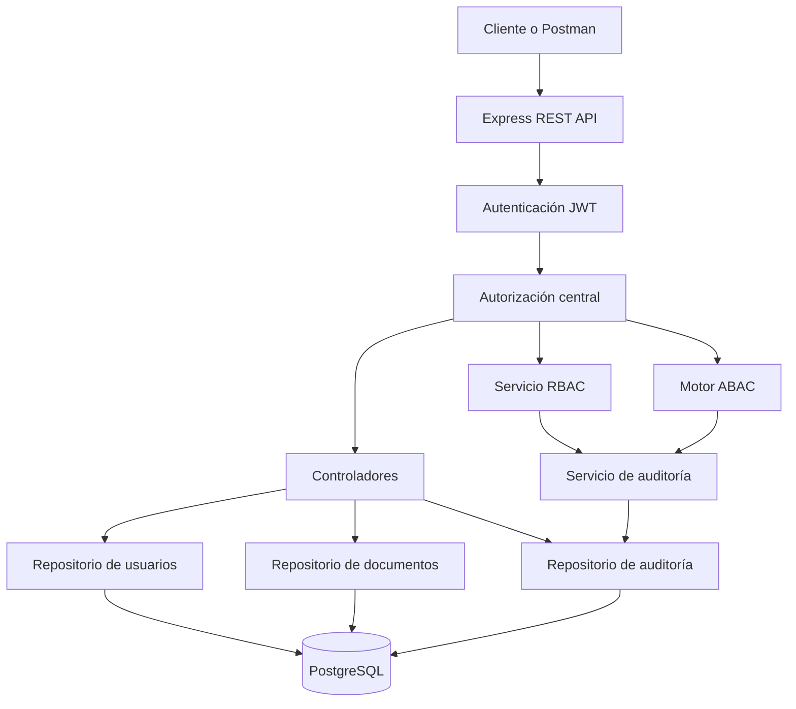
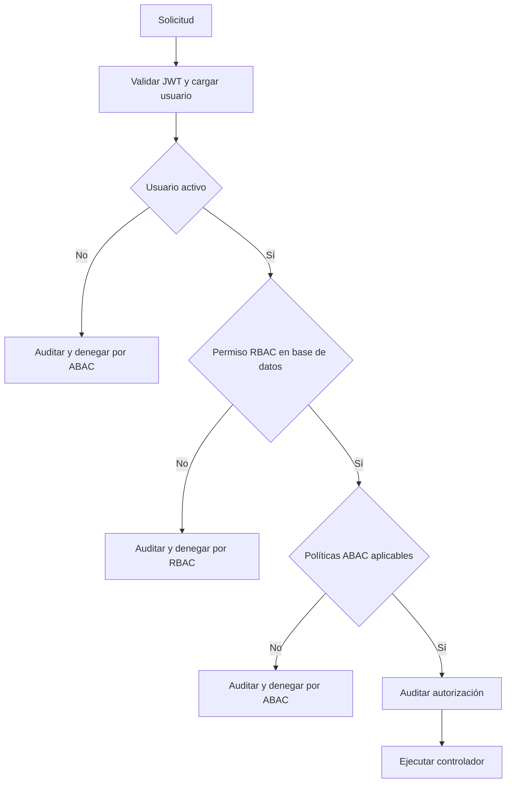

# Arquitectura de SecureDocs

SecureDocs usa una arquitectura REST modular. El middleware de autorización recibe usuario, recurso, acción y entorno; primero consulta RBAC en PostgreSQL, luego evalúa las políticas ABAC y finalmente registra la decisión antes de continuar o devolver `403`.

## Flujo de autorización

La capa de repositorios concentra consultas parametrizadas. Los controladores validan entradas y orquestan casos de uso, pero no contienen reglas RBAC o ABAC dispersas.

