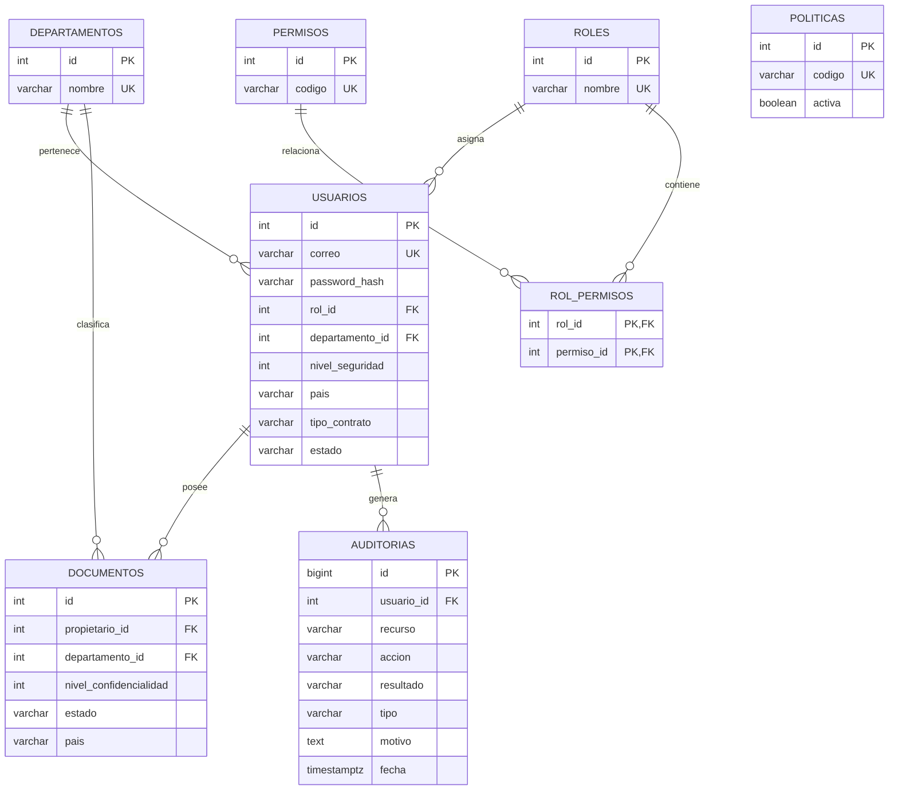

# Modelo de base de datos de SecureDocs

Las tablas incluyen claves foráneas, restricciones de nivel y estado, índices para consultas frecuentes y marcas de tiempo. `auditorias.usuario_id` admite `NULL` para conservar intentos de autenticación cuando el correo no existe.

